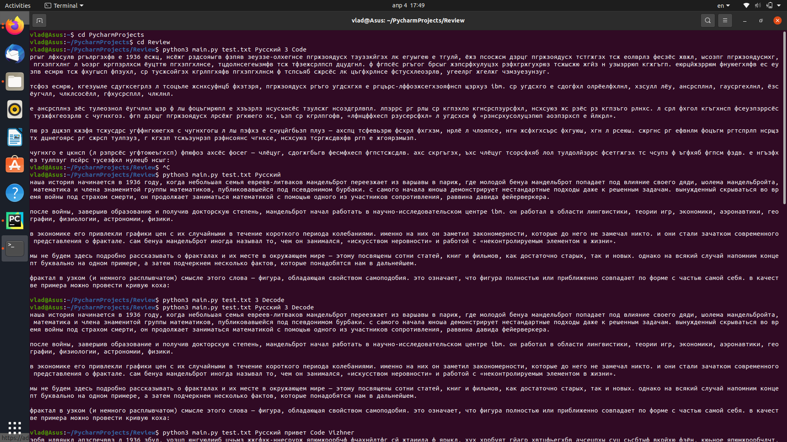
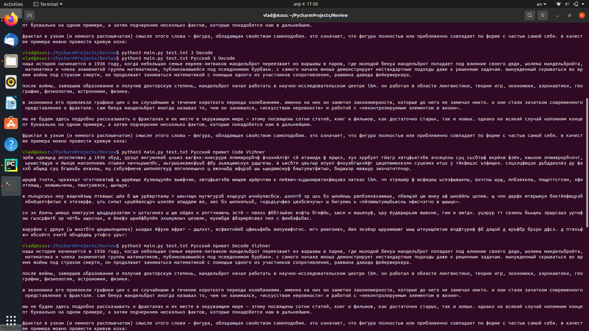
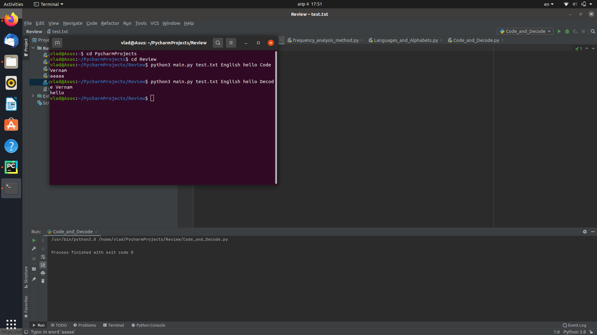
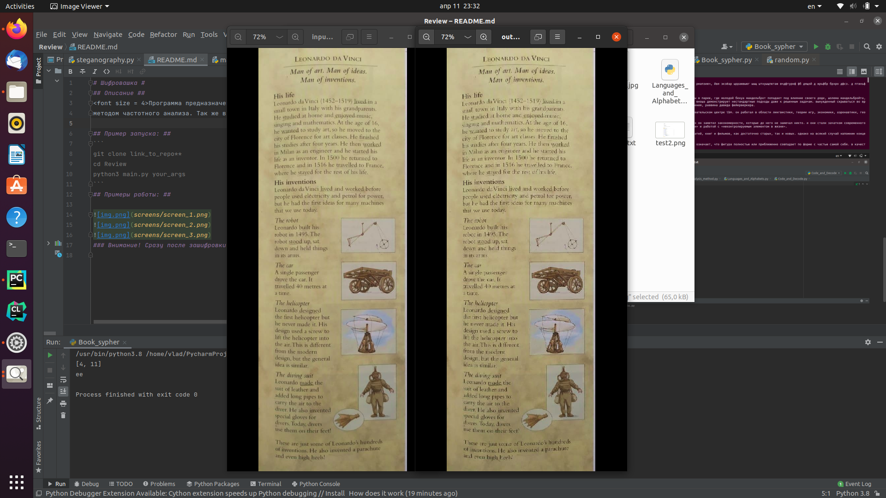

# Шифровашка #
## Описание ##
<font size = 4>Программа предназначена для шифровки\дешифровки текстов шифрами Цезаря, Вернама, Вижнера, а так же взлом шифра цезаря
методом частотного анализа. Так же в программе есть опция зашифровки текста в картинку, а так же алгоритм книжного шифрования.
## Для зашифровки/расшифровки текста методом Вернама и Вижнера в командную строку надо подать 5 аргументов: ##
1. Путь к файлу с текстом
2. Язык текста
3. Ключ шифрования
4. Закодирование или раскодирование
5. Методом Вижнера или Вернама
## Для зашифровки/расшифровки методом Цезаря надо подать 4 аргумента: ##
1. Путь к файлу с текстом
2. Язык текста
3. Ключ шифрования
4. Закодирование или раскодирование
## Для шифрования/дешифрования в/из картинк(у/и) надо подать 3 аргумента: ##
1. Путь к файлу с текстом ( случае дешифровки  можно подать любой символ)
2. Названия картинки в/из котору(ю/ой) надо зашифровать/расшифровать текст
3. Расширение изображения(поддерживаются любые)
Примечание: в
## Для шифрования/дешифрования текста методом книжного шифра надо подать 2 аргумента: ##
1. Путь к файлу с текстом 
2. В случае дешифровки список, которым закодирован текст(в случае шифрования подать любой символ)
3. Ключ
## Для вpлома шифра Цезаря методом частотного аналища надо подать 2 аргумента: ##
1. Путь к файлу с текстом
2. Язык текста
## Пример запуска: ##
```
git clone https://github.com/VladKozlovskiy/Review.git
cd Review
python3 main.py your_args
```
## Примеры работы: ##





### Внимание! Сразу после зашифровки новый текст передавался в файл test.txt для декодирования 
